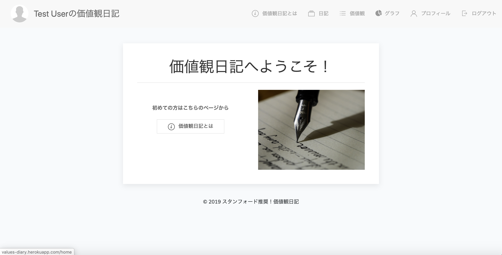
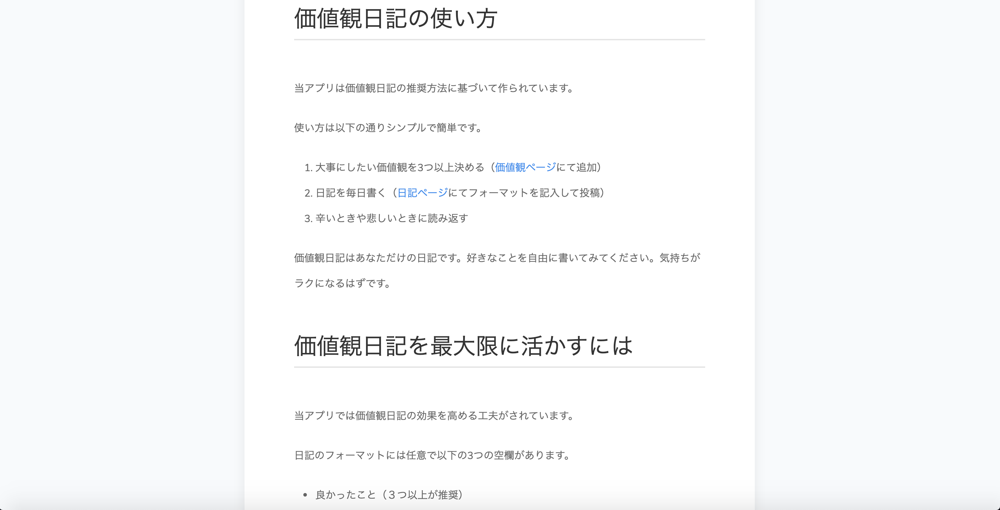
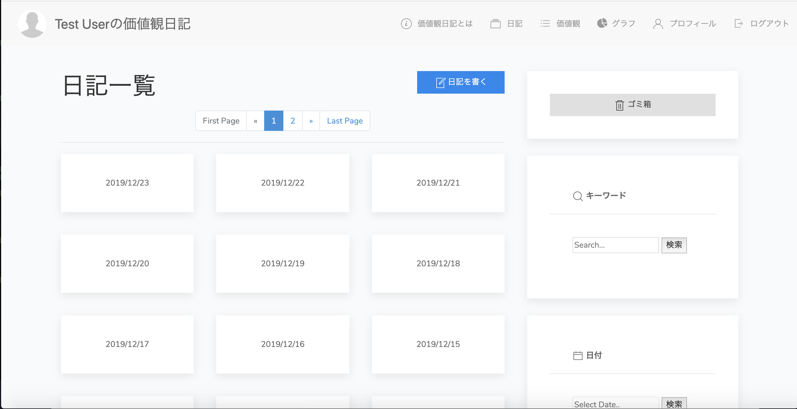
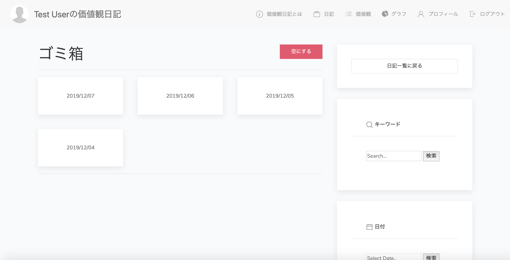
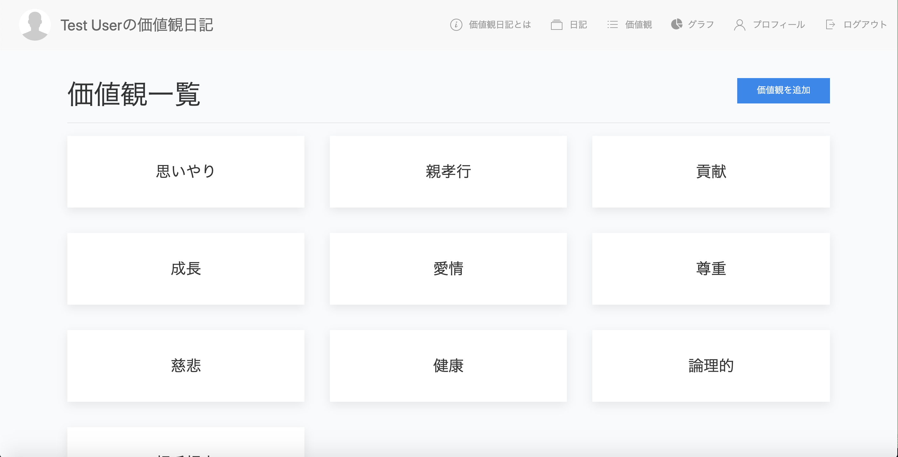
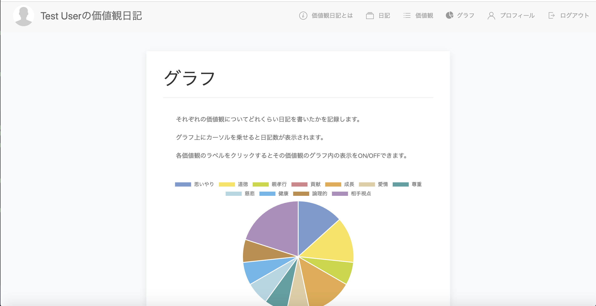
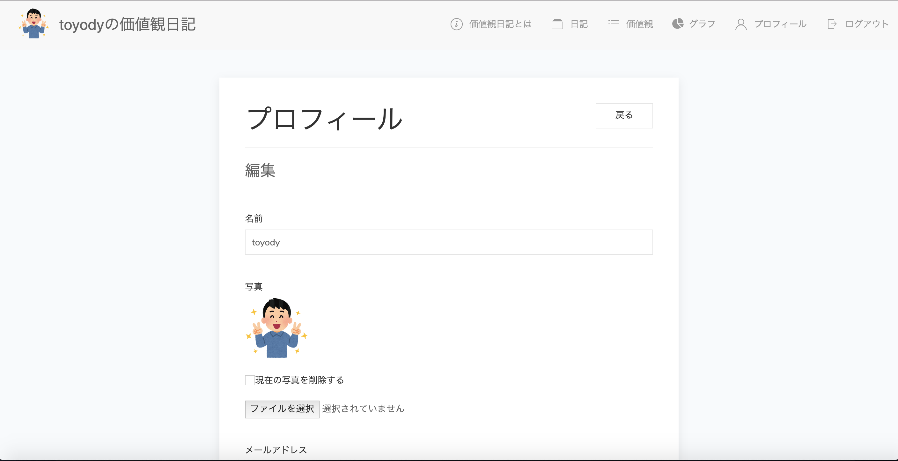
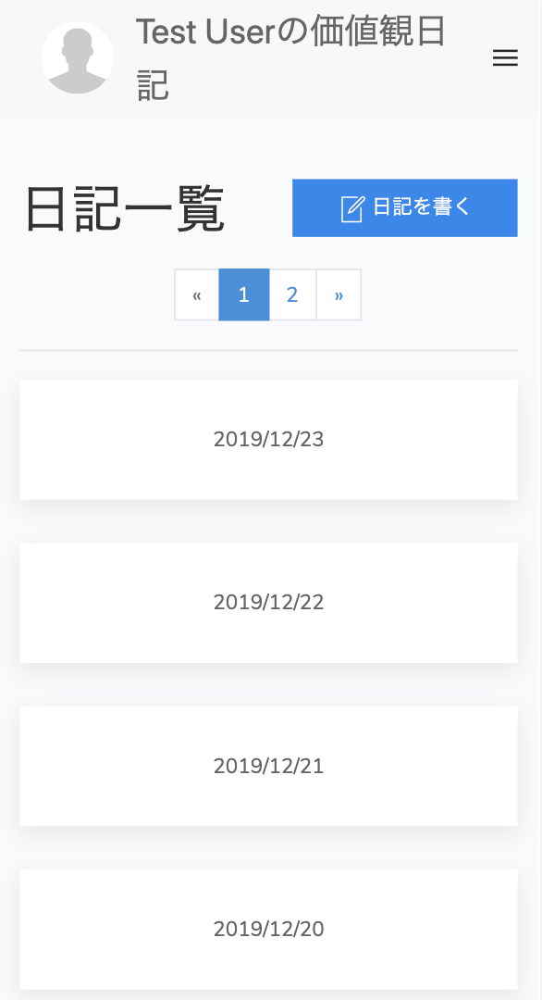
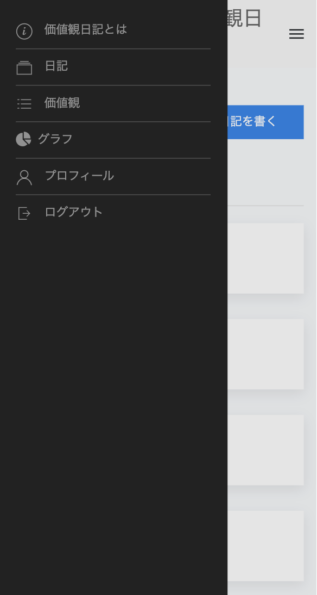

# スタンフォード推奨！価値観日記 (Values_diary)

## 概要

「価値観日記」とは、自分の価値観のために行動したことを毎日記録するための日記です。

スタンフォード大学の実験によると、冬休みの間に価値観日記を書いた学生は健康状態も精神状態も共に良好になったとのこと。

価値観日記の詳細についてはアプリ内で説明されています。

 

今回は転職用ポートフォリオとして「価値観日記」を独自にアレンジして作成しました。
 
スタイリッシュかつ直感的なUIとなっております。

## サンプル画像

### ログイン直後

### 「価値観日記とは」ページ

### 「日記」ページ

### ゴミ箱内

### 「価値観」ページ

### グラフページ

### プロフィール編集ページ

### レスポンシブにも対応

 

## 本番環境

http://values-diary.herokuapp.com/
 
 
(テストユーザーとして簡単にログインできます)
 
 
(お使いの環境によっては日記ページに遷移する際に読み込み時間が少々かかるかもしれません。ご迷惑をおかけします)

## 使用技術

### バックエンド

- PHP 7.3.11
- Laravel 6.5.2
- MySQL 5.7.28
- Nginx
- phpMyAdmin
- PHPUnit
- PHP-cs-fixer
- Laradock
- Docker
- Docker-compose
- Heroku
- AWS(S3)

### フロントエンド

- UIkit
- Bootstrap
- FontAwesome
- JavaScript
- jQuery
- Chart.js
- flatpickr
- Select2
- ESLint

### 開発環境

- Mac
- VScode
- Vim

## 機能一覧

- テストユーザーでかんたんログイン機能
- 日記機能
  - 日記一覧機能
  - 日記投稿機能
  - 日記詳細機能
  - 日記編集機能
  - 日記論理削除機能(ゴミ箱機能)
  - 日記論理削除一覧機能(ゴミ箱内一覧機能)
  - 日記物理削除機能(ゴミ箱内の日記を物理削除する機能と、ゴミ箱を空にする機能)
  - 日記論理削除復元機能(ゴミ箱から日記を復元する機能)
  - 日記キーワード検索機能
  - 日記日付検索機能
  - 日記価値観タグで検索機能
  - ページネーション機能
  - 投稿・編集途中に「戻る」ボタンや「キャンセル」ボタンを押すと「破棄してもよろしいですか？」と確認するモーダル機能
  - ゴミ箱を空にする際の注意喚起モーダル機能
- 価値観機能
  - 価値観一覧機能
  - 価値観投稿機能
  - 価値観詳細機能
  - 価値観編集機能
  - ページネーション機能
  - 投稿・編集途中に「戻る」ボタンや「キャンセル」ボタンを押すと「破棄してもよろしいですか？」と確認するモーダル機能
  - 削除の際の注意喚起モーダル機能
  - S3からPDFファイル表示機能
- グラフ機能
  - 価値観ごとにグラフを描画する機能
- プロフィール機能
  - マイページ機能(ユーザー詳細機能)
  - マイページ編集機能
  - S3を使った画像アップロード機能(アイコン写真)
  - 画像削除機能(アイコン写真の削除)
- テストコード
  - 日記バリデーションチェック(投稿と編集)
  - 価値観のバリデーションチェック(投稿と編集)
  - ユーザーのバリデーションチェック(編集)
  - ログインユーザーで各ページへの遷移チェック
- レスポンシブ対応
  
## 特にこだわった点

- 開発の際にmaster,develop,各featureブランチを使い分けることで擬似的に開発現場を再現(コミット履歴をご覧ください)
- 論理削除機能(ゴミ箱機能)
- 各検索機能
  - キーワード検索機能
  - flatpickrを使った日付検索機能
  - 価値観タグで検索機能
- 多対多リレーション(日記と価値観タグのひも付け)
- 投稿・編集途中に「戻る」ボタンや「キャンセル」ボタンを押すと「破棄してもよろしいですか？」と確認するモーダル機能
- S3の利用
- Chart.jsを使った円グラフの描画
- テストコード
- UIkitを使ったスタイリッシュなUI設計
- レスポンシブ対応

## 時間がなくて到らなかった点
- AWSの各種サービス(VPC,EC2,RDS,ELB,ACM,CloudFront)を使ったアーキテクチャ設計
- 上記によるSSL化
- SSL化が必須であるソーシャルログイン(Facebookログインなど)の機能実装
- CircleCIを使ったCI/CDパイプラインの構築
